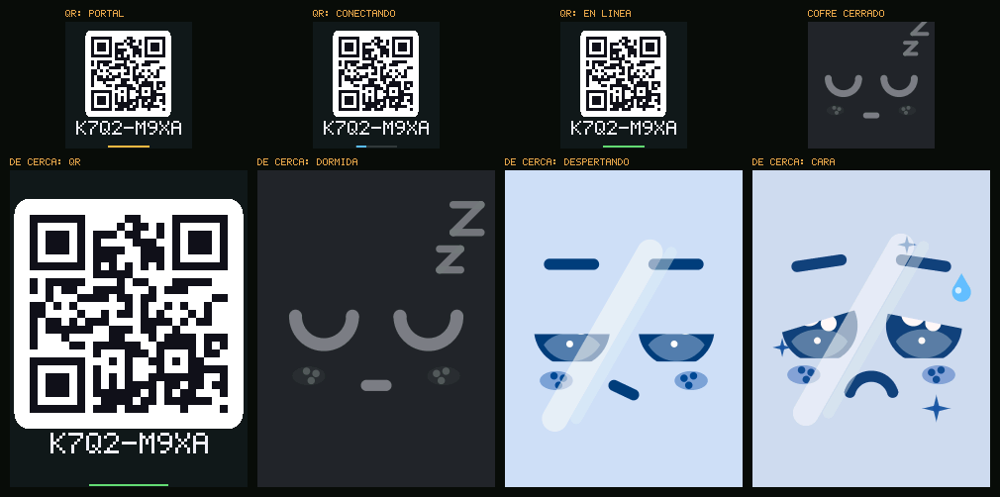
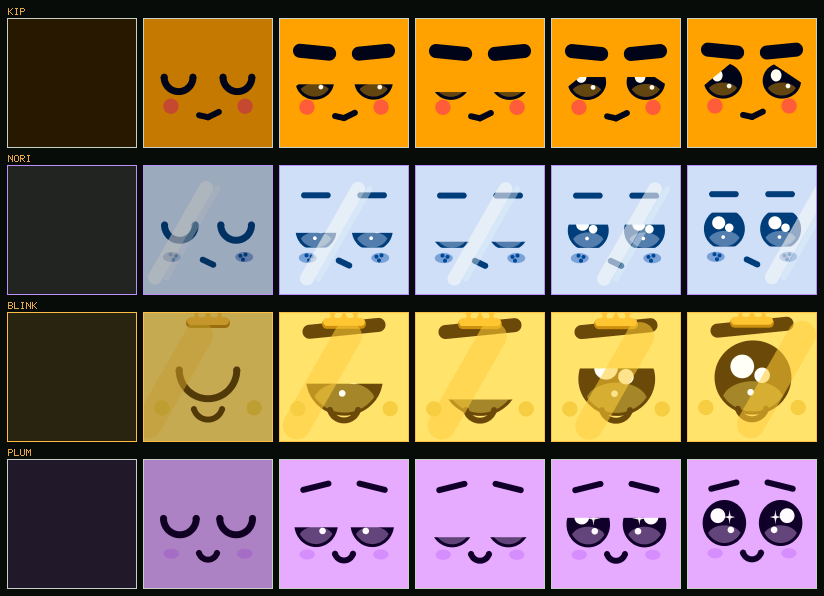

# ROOTKIT

Una maceta con sensores y una pantalla que muestra **dos cosas: un QR al
principio y una cara después**. Cada ROOTKIT es uno de cuatro **Rooties**
—**Kip** el piloto audaz, **Nori** la crítica, **Blink** el cíclope optimista
y **Plum** la berenjenita—: la **carcasa impresa en 3D** es el cuerpo, y la
pantalla pone la cara, que reacciona a lo que necesita la planta. Todo lo
demás —números, tareas, avisos, la colección de Rooties y la charla con tu
planta— vive en **ROOTLAB**, la app del teléfono.


Kip tiene cejas tupidas y ojos rasgados; Nori, ojos almendrados y pecas;
Blink, UN ojo enorme; Plum, ojos de cachorro. Cuando la planta se ahoga el
visor se le llena de agua hasta la mitad, y cuando el aire está seco la cara
se cuartea.

La figura define qué Rooti es; el cofre de la app sortea su **piel**: común
(70 %), rara (25 %) o épica (5 %). Las tres comparten la paleta del personaje
—es parte de quién es— y lo que cambia es el **acabado**: el fuego de Kip, el
acero y el cristal de Nori, el oro de Blink, el aura de Plum. La nube se la
manda a la maceta y la cara se pinta con eso:


Para verlos a los cuatro juntos, en movimiento y con el cuerpo 3D: `npm start`
en root-lab y abrir **`/elenco/`**. Las láminas de acá se regeneran con
`make capturas`.

Del primer encendido a la cara: el QR, los ojos dormidos mientras esperás el
cofre, el despertar y la cara.



Cuando abrís el cofre en la app, la maceta abre los ojos:



Y cuando cambia de ánimo no salta: la cara pasa de una expresión a la otra
en un tercio de segundo, con un parpadeo en el medio.


ROOTLAB se pinta con los colores de la piel que salió, y en el teléfono se ve
el Rooti entero en 3D, con esta misma cara pintada encima, como una mascota
que se acaricia y se cuida.

## Los repositorios

| | Qué hay |
|---|---|
| **rootkit** (este) | Firmware, hardware, carcasas y la documentación del aparato |
| [**root-lab**](https://github.com/ifbotech/root-lab) | **ROOTLAB**: la app, la nube, las cuentas, la IA y el chat con la planta, el correo, las notificaciones y un emulador del Rooti |

Dos cosas de root-lab que se usan desde acá y conviene saber dónde están: **la trastienda** (el panel de quien hace el producto, en `/rootkit/admin`: [docs/trastienda.md](https://github.com/ifbotech/root-lab/blob/main/docs/trastienda.md)) y **los agentes** que revisan el proyecto y anotan mejoras ([agentes/](https://github.com/ifbotech/root-lab/tree/main/agentes), con [RUTINAS.md](https://github.com/ifbotech/root-lab/blob/main/agentes/RUTINAS.md) para dejarlos corriendo).

El agente de hardware, en cambio, vive **acá**: [agentes/ingeniero-de-hardware.md](agentes/ingeniero-de-hardware.md) diseña la PCB impresa con cinta de cobre y el diagrama de conexiones del producto físico.

**Probalo en línea:** https://ifbotech.com/rootkit/ (emulador en
https://ifbotech.com/rootkit/emulador/).

## El hardware

| | ROOTKIT |
|---|---|
| Placa | ESP32-C3 SuperMini (un ESP32 DevKit en el banco de pruebas) |
| Pantalla | TFT 1,44" 128×128 IPS, en una ventana biselada de la carcasa |
| Sensores | suelo capacitivo (calibrable desde la app), AHT20, BH1750, toque; DS18B20 opcional |
| Batería | 18650 con carga por USB-C: unos 6 meses |
| Carcasa | impresa en 3D **sin soportes**: es el cuerpo del Rooti |

Se **actualiza solo por aire**, con firmware firmado, y sale de **fábrica**
con su identidad grabada: [docs/ota.md](docs/ota.md) y
[docs/fabrica.md](docs/fabrica.md). Detalle de pines, consumo y lista de
compras: [docs/hardware.md](docs/hardware.md). La placa en sí —un sustrato
impreso en 3D con canaletas y cinta de cobre— está en
[docs/pcb.md](docs/pcb.md), y cómo se arma una unidad, en
[docs/armado.md](docs/armado.md).

## Empezar

```bash
make test         # 2012 comprobaciones del firmware, sin placa
make sim          # los cinco Rooties en una ventana, en vivo
make sheet        # 8 Rooties × 11 ánimos
make transicion   # el cambio de ánimo, cuadro a cuadro
make pantallas    # QR, dormida, despertar y cara
make wasm         # el renderer para la app (necesita clang y lld)
make placa        # compila el producto (c3-144) y el banco (devkit-144) con PlatformIO
```

Flashear una placa:

```bash
cd firmware
pio run -e c3-144 -t upload && pio device monitor
```

Para ver el flujo completo sin placa, abrí el emulador en
**https://ifbotech.com/rootkit/emulador/** (o levantá **root-lab** en la
compu): corre este mismo firmware en el navegador y su QR abre ROOTLAB en el
teléfono. Por defecto la placa también sincroniza con ese servidor, por
HTTPS y verificando su certificado.

En Windows el firmware se compila y prueba dentro de WSL. Ver
[docs/entorno.md](docs/entorno.md).

## Estructura

```
firmware/
  core/        ánimo, especies, Rooties, vínculo, enlace, código, SHA-256
  gfx/         framebuffer, antialiasing en punto fijo, tipografía
  art/         expresiones y el rig de caras
  ui/          cara, cara dormida, despertar y QR
  nodo/        sensores, suelo, batería, muestreo adaptativo, historial
  net/         JSON y el contrato con la nube
  esp32/       la placa: pantalla, sensores, portal, red (con certificados), energía
  wasm/        el núcleo compilado para el navegador
  sim/ test/   simulador y pruebas
  third_party/ qrcodegen (MIT)
hardware/pcb/  el sustrato impreso: el dato, el modelo y lo que se genera
docs/          arquitectura, hardware, firmware, nube, roadmap, decisiones
tools/         capturas, estación de fábrica y el generador del sustrato
```

## Documentación

| | |
|---|---|
| [roadmap.md](docs/roadmap.md) | **Checklist y roadmap**: qué está hecho y qué falta, por fase |
| [arquitectura.md](docs/arquitectura.md) | Las tres piezas, el flujo y quién decide qué |
| [hardware.md](docs/hardware.md) | Placa, pantalla, sensores, batería, carga y conexiones |
| [pcb.md](docs/pcb.md) | **La PCB impresa**: el sustrato con canaletas, la cinta de cobre y lo que se verifica solo |
| [conexiones.md](docs/conexiones.md) | El diagrama de conexiones, red por red (generado) |
| [armado.md](docs/armado.md) | **Armar una unidad**: paso a paso, con los controles de multímetro |
| [firmware.md](docs/firmware.md) | Cómo está armado, cómo compilar y qué hace al encender |
| [nube.md](docs/nube.md) | El contrato con la nube, con vectores de prueba |
| [ota.md](docs/ota.md) | Actualizaciones por aire firmadas, y qué pasa si una versión no anda |
| [fabrica.md](docs/fabrica.md) | La estación de fábrica: identidad, registro en la nube y etiqueta |
| [carcasas.md](docs/carcasas.md) | Diseño e impresión de las carcasas |
| [decisiones.md](docs/decisiones.md) | Lo que se decidió, lo que se revisó y por qué |
| [testing.md](docs/testing.md) | Qué cubren las pruebas |
| [entorno.md](docs/entorno.md) | Herramientas y simulador |
