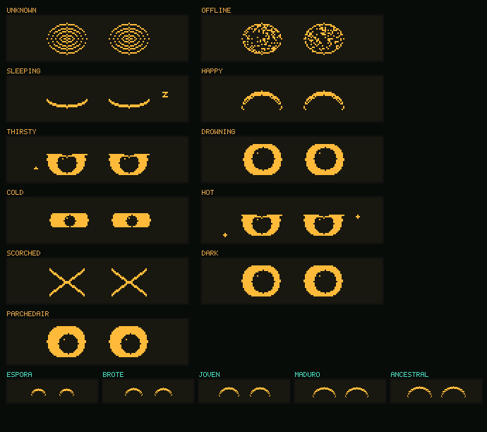

# ROOTKIT

Ecosistema cyber-botánico: sensores en las macetas, un simbionte pixel-art en
el escritorio que reacciona en tiempo real a lo que miden, y un Hub para
registrar plantas y coleccionar criaturas.


La misma criatura, en la OLED de cada maceta:



Y la ceremonia de apertura, con los destellos graduados por rareza:


## Las tres piezas

| Pieza | Qué es | Hardware |
|---|---|---|
| **Terminal** | El objeto de escritorio. Muestra al simbionte y es el servidor local del sistema. | Guition JC3248W535 — ESP32-S3, 3,5" 320×480 IPS, táctil capacitivo. Enchufada. |
| **Spore** | Un nodo por maceta. Mide, reporta y **muestra la cara del simbionte**. | ESP32-C3 + capacitivo v2.0 + AHT21 + BH1750 + OLED 128x32 + 18650. ~2 años de autonomía. |
| **Hub** | PWA servida por la Terminal. Registrar plantas con la cámara, ver la colección. | Ninguno. |

## Empezar

```bash
make test        # 350 comprobaciones: 306 de firmware, 44 del Hub
make sim         # simulador de la Terminal, ventana 320x480
make serve       # Hub de desarrollo en http://localhost:8080
make bench       # medición del rasterizado
make sheet       # hoja de contacto con todos los ánimos
make caras       # las caras de la OLED del Spore
make ceremonia   # la apertura de cápsula, por rareza
```

El firmware necesita un compilador de C y SDL2; en Windows va dentro de WSL.
El Hub necesita Node. Ver [docs/simulador-lvgl.md](docs/simulador-lvgl.md).

En el simulador: `1-3` cambia de planta, `W` riega, `M` cicla los ánimos, `R`
vuelve al ánimo real, `+/-` acelera el tiempo, `S` captura, `ESC` sale. Un día
simulado dura 48 segundos.

## Estructura

```
firmware/
  core/    C99 puro: telemetría, especies, ánimos y la colección.
  net/     Protocolo binario de 24 bytes entre Spore y Terminal.
  spore/   Calibración de suelo, curva de batería y muestreo adaptativo.
  gfx/     Framebuffer RGB565 y framebuffer de 1 bit para la OLED del Spore.
  art/     Tuga.exe en la Terminal, y la cara procedural del Spore.
  ui/      Pantalla principal y ceremonia de apertura. Funciones puras.
  sim/     Host SDL, capturas, hoja de contacto y benchmark.
  test/    Siete suites y los hashes de regresión visual.
hub/
  lib/     Lógica pura, compartida entre la app y los tests.
  test/    Pruebas de formato, validación y contrato de la API.
  API.md   El contrato que la Terminal tiene que implementar.
tools/     Autoría del arte y conversión de capturas.
docs/      Arquitectura, decisiones, pruebas y entorno.
```

## Documentación

- [Arquitectura](docs/arquitectura.md) — cómo encajan las piezas y por qué
- [Decisiones](docs/decisiones.md) — qué se decidió y qué se descartó
- [Pruebas](docs/testing.md) — qué cubre cada suite y qué **no**
- [Contrato de la API](hub/API.md) — Hub ↔ Terminal
- [Entorno](docs/simulador-lvgl.md) — WSL, SDL y el simulador

## Tres ideas que explican casi todo el código

**Cada dato se calcula en un solo lugar.** El Spore mide y no interpreta; la
Terminal interpreta y decide; el Hub muestra y no recalcula. La máquina de
estados de ánimo existe una sola vez, en `firmware/core/mood.c`.

**Medir es barato, transmitir es caro.** Una medición cuesta 250 nAh y una
transmisión 28.000: 110 veces más. Por eso el Spore desacopla las dos
cadencias, mide cada pocos minutos y emite sólo cuando hay algo que contar.
Una semana simulada da 68% menos de radio que un intervalo fijo.

**Tuga.exe es un rig, no un flipbook.** Un cuerpo, ocho juegos de ojos, seis
bocas y una capa de efectos que se combinan según el ánimo, más animación
procedural. Agregar un estado es agregar una fila a una tabla, y el próximo
simbionte reutiliza todo el sistema cambiando sólo el cuerpo.

**La rareza es mérito, no suerte.** Sale de la dificultad hortícola de la
especie: el potus da un común porque perdona todo, el bonsái da un legendario
porque mantenerlo vivo es trabajo real. La ceremonia de apertura se conserva
entera —cápsula, temblor, estallido, destellos graduados— pero el resultado ya
está decidido antes de que empiece. Y el simbionte crece con **días sanos**, no
con días transcurridos: una planta abandonada tiene un simbionte que no
evoluciona.

## Estado

- [x] Núcleo: telemetría, especies, estados de ánimo con histéresis y ciclo día/noche
- [x] Motor gráfico RGB565 propio, optimizado y medido
- [x] `Tuga.exe`: rig completo con 11 estados animados
- [x] Pantalla de la Terminal: escena, diálogo, medidores, selector
- [x] Simulador SDL con mundo simulado, capturas, hoja de contacto y benchmark
- [x] Protocolo binario Spore ↔ Terminal con CRC y control de secuencia
- [x] Núcleo del Spore: calibración, batería y muestreo adaptativo
- [x] Hub: PWA, registro con foto e identificación, colección
- [x] Cara del simbionte en la OLED del Spore, con crecimiento por etapas
- [x] Colección: 12 simbiontes, cuatro rarezas y ceremonia de apertura
- [x] 350 pruebas automatizadas y regresión visual por hash
- [x] CI en GitHub Actions
- [ ] Capa HAL del ESP32 (ADC, I2C, QSPI, Wi-Fi)
- [ ] Servidor HTTP en la Terminal
- [ ] Persistencia en NVS
- [ ] Carcasas impresas

## Lo primero cuando llegue el hardware

1. **Multímetro en serie sobre el C3 dormido.** Si el reposo está en
   miliamperios y no en microamperios, toda la cuenta de autonomía cambia.
2. **Framerate real con full-refresh** en la Guition.
3. **Calibración de dos puntos** del capacitivo, aire y agua, guardada en NVS.
