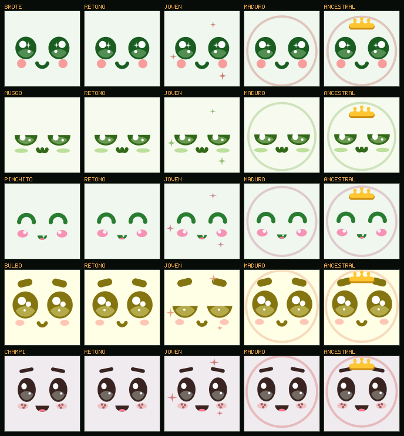
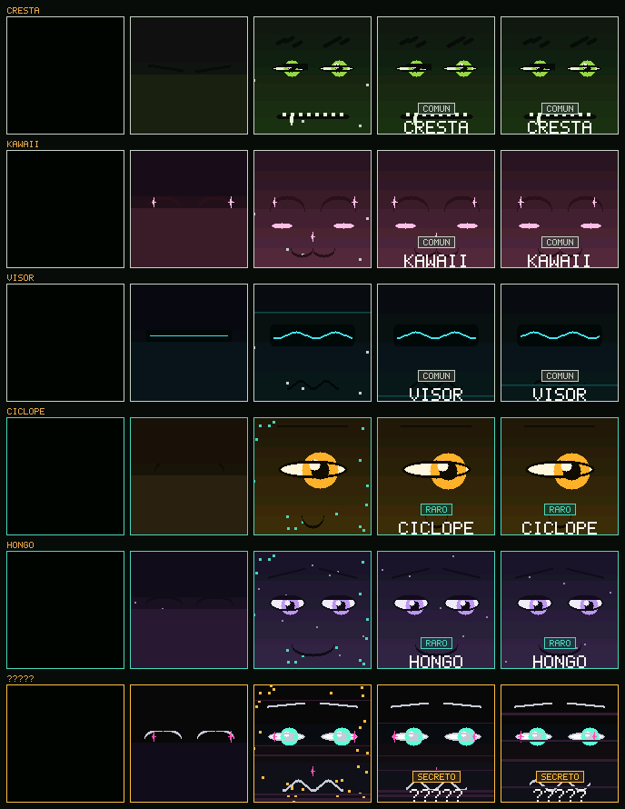

# ROOTKIT

Sensores en la maceta y una cara en la pantalla que reacciona a lo que miden.
**El personaje es la carcasa impresa en 3D**; la pantalla sólo pone la cara que
le hace juego. Se compra en caja ciega: cinco modelos a la vista y un secreto.


Lo que se gana cuidando la planta es cómo se ve: los días sanos desbloquean
brillos, aura y corona.



Y el primer encendido, cuando el aparato se descubre la cara:



## Las piezas

| Pieza | Qué es | Hardware |
|---|---|---|
| **ROOTKIT** | Un aparato por maceta. Mide, evalúa su propia planta y muestra una cara. | ESP32-C3 + TFT 1,44" 128×128 IPS ST7735 SPI + capacitivo v2.0 + AHT21 + BH1750 + 18650. |
| **Carcasa** | El personaje. Impresa en 3D, seis modelos. Es lo que se colecciona. | Filamento. El secreto va en translúcido. |
| **App** | El tablero: tareas del día, lecturas, escáner y colección. Se instala desde el QR de la caja y abre a pantalla completa. | Ninguno. PWA sin build. |

## Empezar

```bash
make test        # 956 comprobaciones: 862 de firmware, 94 de la app
make sim         # los seis modelos en una ventana, animándose en vivo
make serve       # app de desarrollo en http://localhost:8080
make sheet       # los 6 modelos x 11 ánimos
make etapas      # las 5 etapas de crecimiento, por modelo
make revelado    # el primer encendido, por modelo
make bench       # costo de renderizar una cara
```

El firmware necesita un compilador de C y SDL2; en Windows va dentro de WSL.
La app necesita Node. Ver [docs/entorno.md](docs/entorno.md).

En el simulador: `1-6` selecciona, `W` riega, `M` cicla los ánimos, `R` vuelve
al ánimo real, `G` dispara el primer encendido, `+/-` acelera el tiempo, `S`
captura, `ESC` sale. Un día simulado dura 48 segundos.

## Estructura

```
firmware/
  core/    C99 puro: telemetría, especies, ánimos, vínculo, modelos y kit.
  net/     Protocolo binario de 26/32 bytes y el pegamento con el kit.
  nodo/    Calibración de suelo, curva de batería y muestreo adaptativo.
  gfx/     Framebuffer RGB565: elipses, arcos, trazos y tipografía.
  art/     La tabla de expresiones y el rig procedural de caras.
  ui/      La pantalla y el primer encendido. Funciones puras.
  sim/     Host SDL, capturas, hojas de contacto y benchmark.
  test/    Siete suites y los hashes de regresión visual de las 66 caras.
hub/
  lib/     Lógica pura, compartida entre la app y los tests.
  vistas/  Una pantalla por archivo: hoy, plantas, escáner, colección.
  test/    Tareas, diagnóstico, gamificación y contrato de la API.
  API.md   El contrato que el firmware tiene que implementar.
tools/     Conversión de capturas y sincronía del catálogo.
docs/      Arquitectura, decisiones, carcasas, pruebas y entorno.
```

## Seis ideas que explican casi todo el código

**La variedad es física; la cara es digital.** Lo único que se diseña en
pixeles es la cara. Lo que cambia entre modelos es la carcasa impresa. Imprimir
una carcasa cuesta filamento y unas horas de modelado; dibujar y animar un
cuerpo cuesta semanas. Y una cara sola en 128×128 tiene más pixeles por rasgo
que un cuerpo entero: se expresa mejor, no peor.

**El ánimo dice qué siente; la persona dice cómo lo muestra.** Sed en el Cresta
es un ceño apretado con dientes; en el Kawaii, ojos llorosos con una lágrima;
en el Visor, la onda que se quiebra en picos. Seis modelos por once ánimos son
**66 caras**, y salen todas del mismo código porque la cara es procedural y no
sprites. Agregar un modelo es agregar una fila a una tabla.

**Cada aparato evalúa su propia maceta; nadie recalcula.** Corre `core/mood.c`
con los umbrales que le llegaron por radio y muestra el ánimo sin preguntarle
a nadie — uno que necesita la red para saber qué cara poner se queda mudo justo
cuando más importa. Y quien recibe copia el ánimo en vez de recalcularlo,
porque si lo recalculara su histéresis sería distinta y las dos puntas
discreparían sobre la misma planta.

**Medir es barato, transmitir es caro.** Una medición cuesta 250 nAh y una
transmisión 28.000: 110 veces más. Por eso las dos cadencias están
desacopladas. Una semana simulada da 68% menos de radio que un intervalo fijo.

**El azar está en la caja, no en el software.** La rareza es del modelo de
carcasa que te tocó, no de la dificultad de tu planta. Dentro de la app no hay
ninguna tirada de dados, así que el terreno regulado de las cajas de botín
directamente no aplica. Lo que sí se gana con trabajo es **cómo se ve**: los
días sanos desbloquean capas cosméticas, y un aparato desenchufado no acumula
progreso gratis.

**Una tarea es un verbo, no un estado.** "Regar la Monstera" es una tarea;
"Monstera con sed" es un estado. Y cada tarea muestra el número que la
justifica —"la tierra está al 22% y quiere entre 25 y 60"— porque sin el
número la app pide fe. Las tareas además **se cierran solas**: si regás, el
sensor lo ve y desaparecen sin tildar nada.

## Documentación

- [Arquitectura](docs/arquitectura.md) — cómo encajan las piezas y por qué
- [Decisiones](docs/decisiones.md) — qué se decidió, qué se descartó y **qué se
  revisó**
- [Carcasas](docs/carcasas.md) — envolvente, tolerancias y brief de cada modelo
- [La app](docs/app.md) — las cuatro pantallas, la instalación y el diagnóstico
- [Pruebas](docs/testing.md) — qué cubre cada suite y qué **no**
- [Contrato de la API](docs/../hub/API.md) — app ↔ aparato
- [Entorno](docs/entorno.md) — WSL, SDL y el simulador

## Estado

- [x] Núcleo: telemetría, especies, ánimos con histéresis y ciclo día/noche
- [x] Seis modelos de carcasa con su carácter, en una tabla editable
- [x] Rig procedural de caras: 6 familias de ojos, 4 de cejas, 5 de bocas
- [x] Las 66 caras distinguibles entre sí, verificado por hash
- [x] Crecimiento visible: brillos, aura y corona por días sanos
- [x] Pantalla del aparato: la cara a sangre, pictograma y aviso de batería
- [x] El primer encendido, con destellos graduados por rareza
- [x] Protocolo v2: umbrales de especie y carcasa hacia el aparato
- [x] Simulador SDL que muestra los seis modelos animándose a la vez
- [x] Núcleo del nodo: calibración, batería y muestreo adaptativo
- [x] App instalable: tareas del día, tablero, escáner, colección y niveles
- [x] Diagnóstico por foto que cruza lo que se ve con lo que miden los sensores
- [x] 956 pruebas automatizadas y regresión visual por hash
- [x] CI en GitHub Actions
- [ ] **Las seis carcasas modeladas** — ver [docs/carcasas.md](docs/carcasas.md)
- [ ] Capa HAL del ESP32 (ADC, I2C, SPI, Wi-Fi)
- [ ] Servidor HTTP que implemente `hub/API.md`
- [ ] Persistencia en NVS
- [ ] Decidir dónde vive la API: nube o concentrador local (ver docs/app.md)

## Lo primero cuando llegue el hardware

Tres supuestos que hoy están escritos como si fueran ciertos:

1. **Multímetro en serie sobre el C3 dormido.** Si el reposo está en
   miliamperios y no en microamperios, toda la cuenta de autonomía cambia.
2. **Corriente de la retroiluminación.** El modelo asume 32 mA. De ahí salen
   los 595 días.
3. **Una cara encendida adentro de una carcasa, de noche.** El sombrero del
   Hongo le tira sombra a la pantalla a propósito; hay que confirmar que su
   cara oscura sigue leyéndose. Si no, se sube el brillo de su paleta en
   `persona.c` —una línea— y listo.

Y **calibración de dos puntos** del capacitivo, aire y agua, guardada en NVS.
