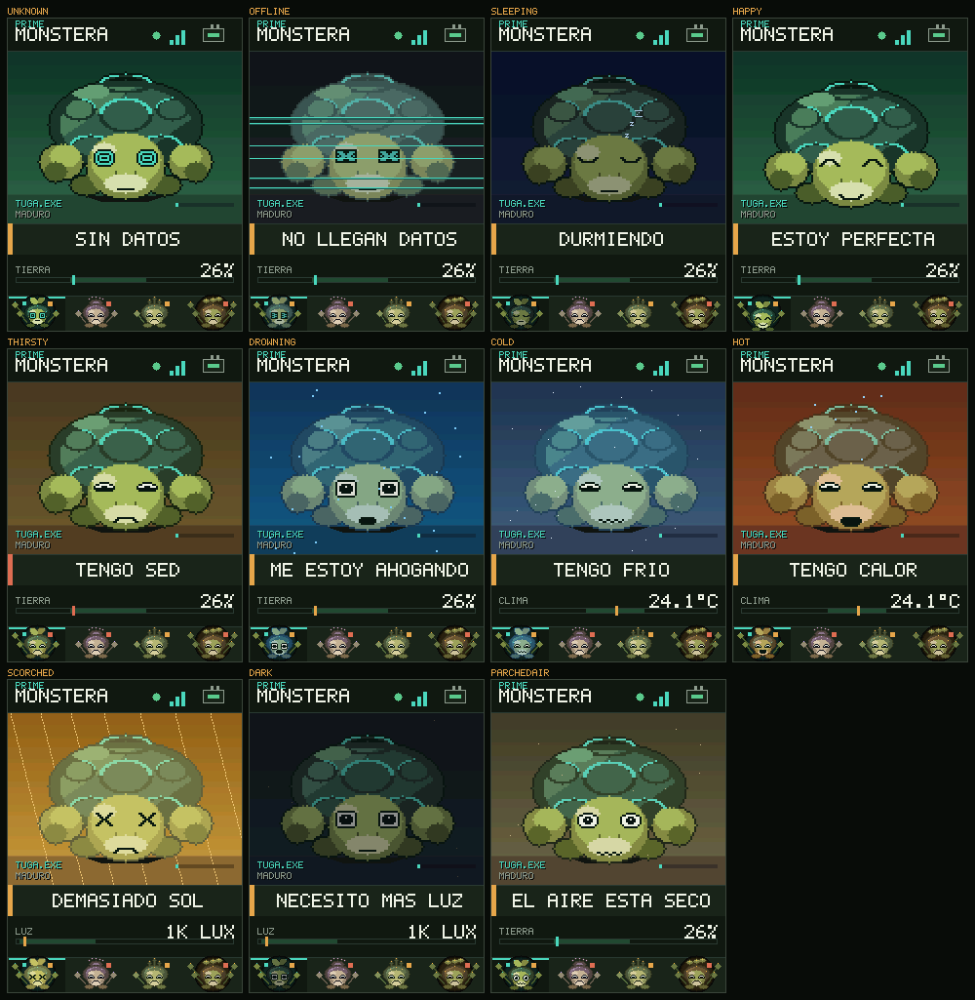
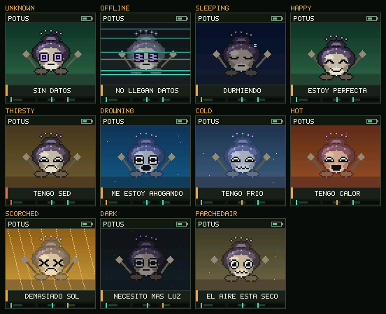
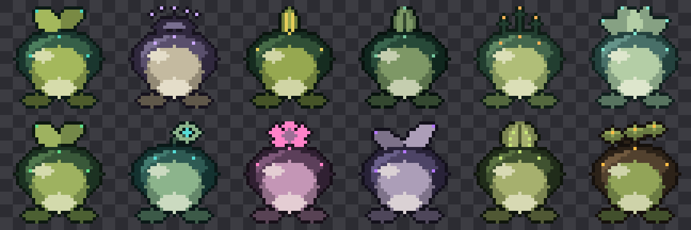
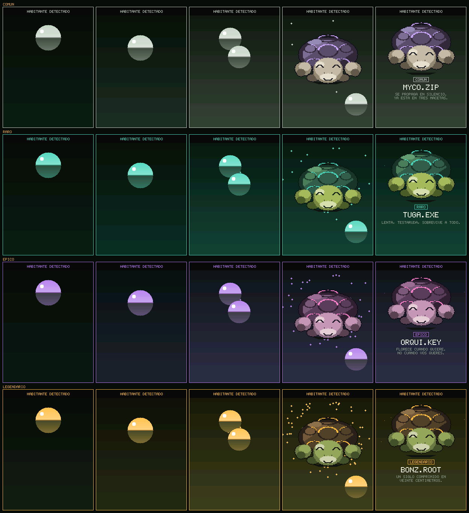

# ROOTKIT

Ecosistema cyber-botánico: sensores en las macetas y un simbionte pixel-art que
reacciona en tiempo real a lo que miden. **El mismo bicho se ve adulto en el
Prime y brote en cada Mini** — la misma criatura, mirada a dos distancias.



El mismo momento, en la maceta:



Los doce simbiontes, en sus cinco etapas de crecimiento:



Y la ceremonia de apertura, con los destellos graduados por rareza:



## Las piezas

| Pieza | Qué es | Hardware |
|---|---|---|
| **Prime** | Una maceta más, pero enchufada: muestra al simbionte **adulto** a 22 mm, abre las cápsulas y es el servidor local del kit. | ESP32-C3 + TFT 2,2" 240×320 ILI9341 SPI + capacitivo v2.0 + AHT21 + BH1750. ARS 49.100. |
| **Mini** | Un nodo por maceta. Mide, **evalúa su propia planta** y muestra al simbionte **brote** a 13 mm. | ESP32-C3 + TFT 1,44" 128×128 IPS ST7735 SPI + los mismos sensores + 18650. ARS 44.360. |
| **Hub** | PWA servida por el Prime. Registrar plantas con la cámara, ver la colección. | Ninguno. |

Un kit es un Prime y hasta cinco Minis.

## Empezar

```bash
make test        # 805 comprobaciones: 752 de firmware, 53 del Hub
make sim         # el kit entero en una ventana: Prime + Minis, en vivo
make serve       # Hub de desarrollo en http://localhost:8080
make bench       # medición del rasterizado en los dos paneles
make sheet       # hoja de contacto del Prime
make minis       # hoja de contacto del Mini
make brotes      # los 12 simbiontes en sus 5 etapas
make ceremonia   # la apertura de cápsula, por rareza
```

El firmware necesita un compilador de C y SDL2; en Windows va dentro de WSL.
El Hub necesita Node. Ver [docs/entorno.md](docs/entorno.md).

En el simulador: `1-4` selecciona un nodo, `W` riega, `M` cicla los ánimos, `R`
vuelve al ánimo real, `G` dispara la ceremonia, `O` marca el nodo como caído,
`+/-` acelera el tiempo, `S` captura, `ESC` sale. Un día simulado dura 48
segundos.

## Estructura

```
firmware/
  core/    C99 puro: telemetría, especies, ánimos, colección y el kit.
  net/     Protocolo binario de 26/32 bytes y el pegamento con el kit.
  nodo/    Calibración de suelo, curva de batería y muestreo adaptativo.
  gfx/     Framebuffer RGB565, tipografía y los dos paneles como datos.
  art/     Sprites generados, la tabla de carácter y los dos rigs.
  ui/      Pantalla del Prime, del Mini y la ceremonia. Funciones puras.
  sim/     Host SDL, capturas, hojas de contacto y benchmark.
  test/    Ocho suites y los hashes de regresión visual, uno por panel.
hub/
  lib/     Lógica pura, compartida entre la app y los tests.
  test/    Pruebas de formato, validación, vínculo y contrato de la API.
  API.md   El contrato que el Prime tiene que implementar.
tools/     Autoría del arte, conversión de capturas y sincronía del catálogo.
docs/      Arquitectura, decisiones, pruebas y entorno.
```

## Cinco ideas que explican casi todo el código

**El mismo organismo, a dos escalas.** El brote no es el adulto reducido:
invierte sus proporciones. Donde el adulto es caparazón con una cabeza asomando,
el brote es cabeza con un caparazón asomando. Cabeza grande, ojos grandes y
bajos, cuerpo chico — el esquema infantil. Por eso 32×32 se leen como la cría
del mismo bicho y no como otro bicho más chico. Y por eso el Prime tiene una
razón de ser que no es "una pantalla más grande": **es donde tus criaturas están
grandes**.

**Cada nodo evalúa su propia maceta; nadie recalcula.** Los dos corren el mismo
`core/mood.c` con los umbrales que les llegaron por radio, y el ánimo viaja ya
resuelto. Un nodo que necesita la red para saber qué cara poner se queda mudo
justo cuando más importa. Y el Prime copia lo que recibe en vez de recalcularlo,
porque si lo recalculara su histéresis sería distinta y las dos pantallas
discreparían sobre la misma planta.

**Medir es barato, transmitir es caro.** Una medición cuesta 250 nAh y una
transmisión 28.000: 110 veces más. Por eso las dos cadencias están desacopladas
— se mide cada pocos minutos y se emite sólo cuando hay algo que contar. Una
semana simulada da 68% menos de radio que un intervalo fijo.

**El simbionte es un rig, no un flipbook.** Un cuerpo, ocho juegos de ojos, seis
bocas y una capa de efectos que se combinan según el ánimo, más animación
procedural. Agregar un estado es agregar una fila a una tabla. Y esa tabla vive
**una sola vez**, compartida entre el adulto y el brote: si estuviera duplicada,
el Prime y el Mini dirían cosas distintas de la misma planta.

**La rareza es mérito, no suerte.** Sale de la dificultad hortícola de la
especie: el potus da un común porque perdona todo, el bonsái da un legendario
porque mantenerlo vivo es trabajo real. La ceremonia se conserva entera
—cápsula, temblor, estallido, destellos graduados— pero el resultado ya está
decidido antes de que empiece. Y el simbionte crece con **días sanos**: una
planta abandonada tiene un simbionte que no evoluciona, y un nodo desenchufado
no acumula progreso gratis.

## Documentación

- [Arquitectura](docs/arquitectura.md) — cómo encajan las piezas y por qué
- [Decisiones](docs/decisiones.md) — qué se decidió, qué se descartó y **qué se
  revisó**
- [Pruebas](docs/testing.md) — qué cubre cada suite y qué **no**
- [Contrato de la API](hub/API.md) — Hub ↔ Prime
- [Entorno](docs/entorno.md) — WSL, SDL y el simulador

## Estado

- [x] Núcleo: telemetría, especies, ánimos con histéresis y ciclo día/noche
- [x] El kit: roster de Prime + Minis, salud del enlace y vínculo por nodo
- [x] Motor gráfico RGB565 propio, con blit escalado por enteros, medido
- [x] Doce simbiontes: adulto de 96×72 y brote de 32×32, doce paletas
- [x] Pantalla del Prime a 240×320 y del Mini a 128×128, las dos nativas
- [x] Crecimiento visible: cinco etapas, cascarón, hojas y aura
- [x] Protocolo v2: umbrales de especie hacia el nodo, ánimo resuelto de vuelta
- [x] Simulador SDL que muestra el kit entero animándose a la vez
- [x] Núcleo del nodo: calibración, batería y muestreo adaptativo
- [x] Hub: PWA, registro con foto, colección y barra de vínculo
- [x] 805 pruebas automatizadas y regresión visual por hash, una tabla por panel
- [x] CI en GitHub Actions
- [ ] Capa HAL del ESP32 (ADC, I2C, SPI, Wi-Fi)
- [ ] Transporte ESP-NOW detrás de `net/link.h`
- [ ] Servidor HTTP en el Prime
- [ ] Persistencia en NVS
- [ ] Carcasas impresas

## Lo primero cuando llegue el hardware

Son las tres cosas que siguen siendo supuestos, y las tres pueden mover números
que hoy están escritos como si fueran ciertos:

1. **Multímetro en serie sobre el C3 dormido.** Si el reposo está en
   miliamperios y no en microamperios, toda la cuenta de autonomía cambia.
2. **Corriente de cada retroiluminación.** El modelo asume 32 mA para la de
   1,44". De ahí salen los 595 días del Mini.
3. **El brote de 32×32 a 2× en la mano.** Los 12,9 mm están calculados con el
   paso de pixel del fabricante. Hay que confirmar que se lee desde un metro.

Y **calibración de dos puntos** del capacitivo, aire y agua, guardada en NVS.
