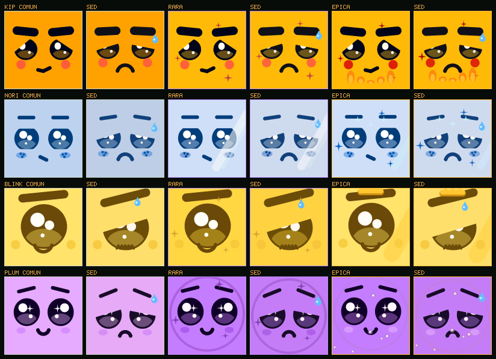
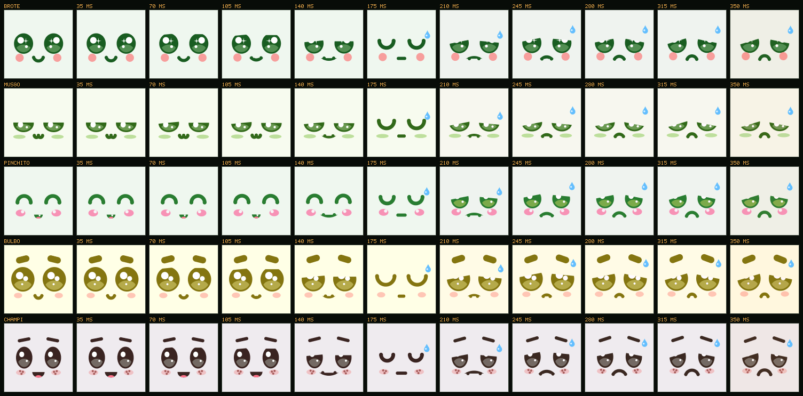

# Firmware

Cómo está armado, cómo se compila y se flashea, y qué hace el aparato desde
que se enciende.

## Dos mitades

```
firmware/
  core/  gfx/  art/  ui/  nodo/  net/  third_party/     C99 portable
  esp32/                                                Arduino, sólo hardware
  sim/  test/  wasm/                                    escritorio y navegador
```

**El núcleo portable decide todo**: qué pantalla mostrar, qué cara poner,
cuándo medir, cuándo hablar con la nube, qué hacer con la respuesta. No
conoce ni un pin. Se compila igual en la placa, en las pruebas del escritorio
(`make test`), en el simulador (`make sim`) y en el navegador (`make wasm`).

**`esp32/` sólo traduce**: lee bytes de los sensores, se los pasa al núcleo y
hace lo que el núcleo pide. Si algo en `esp32/` toma una decisión, está en el
lugar equivocado.

| Carpeta | Qué hay |
|---|---|
| `core/` | ánimo, especies, personajes, vínculo, **enlace** (la máquina de estados del flujo), **código** de vinculación, SHA-256 |
| `gfx/` | framebuffer RGB565, **antialiasing en punto fijo**, tipografía |
| `art/` | la tabla de expresiones y el rig de caras |
| `ui/` | la **cara**, la cara **dormida**, el **despertar** y la pantalla del **QR** |
| `nodo/` | **sensores** (bytes → unidades), calibración de suelo, batería, muestreo adaptativo, **historial** |
| `net/` | **JSON** y el contrato con la **nube** |
| `esp32/` | `main.cpp`, pantalla, sensores, almacenamiento, portal, red, energía |
| `wasm/` | la entrada para compilar el núcleo a WebAssembly |
| `third_party/` | qrcodegen de Nayuki (MIT) |

## Compilar y flashear

Hace falta [PlatformIO](https://platformio.org/) (`pip install platformio`).

```bash
cd firmware
pio run -e c3-144                    # C3 SuperMini + TFT 1,44" (el producto)
pio run -e c3-144 -t upload          # flashear
pio device monitor                   # log por USB
```

| Entorno | Placa | Pantalla |
|---|---|---|
| `c3-144` | ESP32-C3 SuperMini | TFT 1,44" 128×128 ST7735S: **el producto** |
| `devkit-144` | ESP32 DevKit 30 pines | la misma: el banco de pruebas |

El TFT de 2,2" del primer prototipo se retiró ([hardware.md](hardware.md)).
La versión va en `platformio.ini` (`RK_FW_VERSION`): es la que el aparato le
dice a la nube y la que decide si hay una actualización ([ota.md](ota.md)).

**Antes de flashear, apuntar a la nube.** En `platformio.ini`:

```ini
-DRK_NUBE_URL=\"https://ifbotech.com/rootkit\"   ; la versión de prueba en el VPS (por defecto)
-DRK_NUBE_URL=\"http://192.168.0.20:8080\"       ; o la PC con root-lab (sólo placa de banco)
-DRK_APP_URL=\"\"                                 ; base del QR, si es otra
```

`RK_NUBE_URL` es con quién sincroniza el aparato. `RK_APP_URL` es a dónde
lleva el QR: normalmente la misma. Por defecto apunta al VPS
(`https://ifbotech.com/rootkit`): el QR sale como
`HTTPS://IFBOTECH.COM/ROOTKIT/V/<código>` (en mayúsculas, para el modo
alfanumérico del QR) y abre una app con HTTPS, que se puede instalar y
recibe notificaciones. Con root-lab en la PC la app abre por HTTP y no se
instala; para eso, `RK_APP_URL` con la URL de un túnel HTTPS mientras la
placa sigue hablando con la PC por la red local.

La placa verifica el certificado del servidor contra raíces fijadas: ver
"Seguridad" más abajo.

### El banco y el producto

El aparato manda su token en cada pedido, y con ese token cualquiera se hace
pasar por él. Por eso hay dos clases de placa:

| | Producto (`c3-144`) | Banco (`devkit-144`, o cualquiera con `-DRK_BANCO=1`) |
|---|---|---|
| Con qué nube habla | `RK_NUBE_URL`, fija | la de `RK_NUBE_URL` o la que se elija en el portal ("Avanzado") |
| `http://` | **no**: el token no sale sin TLS | sí, para root-lab en la PC |
| El campo "Servidor" del portal | no aparece, y si llega se ignora | aparece |
| Una nube guardada en la memoria | se ignora: manda `RK_NUBE_URL` | se usa, si pasa el control |

El control es `rk_nube_url_aceptable()` (`net/nube.c`, probado en
`test/test_red.c`): `https://` exacto y en minúsculas —así lo mira el
transporte para elegir TLS; `HTTPS://` iría por TCP plano al 443 con el token
adentro—, con un servidor después, sin usuario (`https://a@b` va a `b`), sin
espacios ni caracteres de control, y que entre en los buffers. `red.cpp` y
`ota.cpp` se niegan a mandar el token a una URL que no pase, y lo dicen por
el puerto serie.

Por qué el producto no deja elegir: el portal de configuración es una red
wifi abierta. Quien estuviera cerca mientras alguien configura su maceta
podía poner su propio servidor y quedarse con el token. Mudar el producto a
otra nube (un dominio propio, por ejemplo) se hace publicando por aire una
versión con otro `RK_NUBE_URL`.

Para usar una C3 contra la PC:

```bash
PLATFORMIO_BUILD_FLAGS="-DRK_BANCO=1" pio run -e c3-144 -t upload
```

Si la imagen del panel sale corrida o con colores cambiados:
`-DRK_TFT_OFS_X=2 -DRK_TFT_OFS_Y=1 -DRK_TFT_BGR=1 -DRK_TFT_INVERT=1`.

## Del encendido a la cara

La máquina de estados vive en `core/enlace.c` y está probada paso por paso,
incluidos los caminos feos, en `test/test_enlace.c`.

```
              ┌──────────── botón 10 s (borra todo) ◄────────────┐
              ▼                                                   │
        ┌──────────┐  portal recibió la red   ┌────────────┐     │
        │ SIN_WIFI │ ───────────────────────► │ CONECTANDO │     │
        │  QR +    │ ◄─────── 3 fallos ────── │     QR     │     │
        │  portal  │                          └─────┬──────┘     │
        └──────────┘                                │ wifi ok    │
                                                    ▼            │
                                            ┌──────────────┐     │
                          desvincular ────► │ SIN_VINCULO  │     │
                          (código nuevo)    │  QR, consulta│     │
                                            │  cada 3 s    │     │
                                            └──────┬───────┘     │
                                                   │ la app lo   │
                                                   ▼ reclamó     │
                                            ┌──────────────┐     │
                                            │ ESPERA_COFRE │     │
                                            │ ojos dormidos│     │
                                            └──────┬───────┘     │
                                                   │ cofre       │
                                                   ▼ abierto     │
                                            ┌──────────────┐     │
                                            │ DESPERTANDO  │     │
                                            │   2,6 s      │     │
                                            └──────┬───────┘     │
                                                   ▼             │
                                            ┌──────────────┐     │
                                            │    ACTIVO    │ ────┘
                                            │   la cara    │
                                            └──────────────┘
```

Tres reglas que salen de ahí:

1. **Un aparato que ya tenía cara arranca con la cara**, sin esperar al wifi
   ni a la nube.
2. **Una vez vinculado, nada de la red cambia la pantalla.** Un corte no es
   una desvinculación; sólo la nube, diciendo `vinculado: false`, devuelve el
   QR.
3. **Cada desvinculación sube la época**, y el código del QR sale de la
   época: el QR viejo deja de valer en ese momento.

## Qué pasa en cada vuelta del bucle

`esp32/main.cpp` no bloquea nunca:

0. **Fábrica.** Si por el puerto serie llega una orden `FABRICA {...}` y el
   aparato no está vinculado, graba secreto, Rooti y lote
   ([fabrica.md](fabrica.md)).
1. **Botón.** Tocar prende la pantalla. Mantener: a los 2 s los ojos
   empiezan a cerrarse; a los 10 s se borra el vínculo y el wifi.
2. **Portal.** Si el enlace lo pide, levanta la red `ROOTKIT-XXXX` con DNS
   cautivo y la página para elegir el wifi.
3. **Wifi.** Conecta, reintenta, avisa al enlace.
4. **Medir**, cuando toca según el muestreo adaptativo: sensores → telemetría
   → ánimo (si hay especie) → historial en flash.
5. **Nube.** Arma el pedido con hasta 20 lecturas pendientes y lo manda en
   una tarea aparte, así la cara no se congela durante el TLS. Aplica la
   respuesta: vínculo, cofre, persona, **rareza** (la piel que salió del
   cofre), nombre, especie, calibración, brillo, modo de pantalla, días
   sanos. Descarta las lecturas confirmadas. Si la app está **calibrando**
   el sensor, mide y cuenta cada 5 s sin dormirse. Si la nube ofrece un
   **firmware** nuevo, decide si lo baja (`core/ota.c`).
6. **Actualización.** La descarga corre en su propia tarea; cuando quedó
   instalada y verificada, guarda todo y reinicia. La versión recién
   instalada tiene diez minutos para hablar con la nube o vuelve a la
   anterior ([ota.md](ota.md)).
7. **Enlace.** Avanza la máquina de estados.
8. **Guardar** en NVS lo que cambió.
9. **Energía.** Enchufado o configurando: pantalla prendida. A batería con
   cara: se apaga a los 20 s y, sin nada pendiente, deep sleep hasta la
   próxima medición o hasta que la toquen.
10. **Dibujar** a 30 fps enchufado o 15 fps a batería, mandando por SPI sólo
   las filas que cambiaron.

## Las caras

`art/face.c` dibuja con formas suavizadas en punto fijo (`gfx/aa.c`): elipses,
cápsulas, semiplanos y triángulos, combinados por intersección. Cada pixel del
borde mezcla color y fondo según cuánto lo cubre la forma, y eso es lo que
separa la ilustración del pixel art. Todo en enteros, porque el C3 no tiene
FPU.

El fondo es liso, del color de la pantalla de la piel, y los párpados se
pintan del mismo color: un párpado que baja es fondo que tapa el ojo. Por eso
no hay degradé.

### Los cinco Rooties y sus pieles

Los Rooties son filas de `core/persona.c`, estilo libro de cuentos (Ooblets,
Pokémon Café ReMix):

| Rooti | Ojos | Brillo | Cejas | Boca | Mejillas |
|---|---|---|---|---|---|
| Brote | `RK_OJOS_REDONDOS`, enormes | `RK_BRILLO_CACHORRO`, espejados | ninguna | `RK_BOCA_SUAVE` | `CIRCULO` |
| Musgo | `RK_OJOS_MEDIALUNA`, "u u" | `SIMPLE` | ninguna | `RK_BOCA_GATO` ":3" | `HORIZONTAL` |
| Pinchito | `RK_OJOS_ARCO` "^ ^", guiña | `SIMPLE` | ninguna | `RK_BOCA_DIENTECITO` | `BRILLO` |
| Bulbo | `RK_OJOS_REDONDOS`, grandes | `RK_BRILLO_DOBLE` | `RK_CEJA_FLOTANTE` | `RK_BOCA_SUAVE` | `SUAVE` |
| Champi | `RK_OJOS_REDONDOS` | `SIMPLE` | `RK_CEJA_FINA` | `RK_BOCA_D` ":D" con lengua | `PECAS` |

Cada fila tiene las proporciones en centésimas del lado de la pantalla y
**tres pieles** (`rk_piel_t`), una por rareza: `nombre`, cuatro colores
(`fondo`, `ojos`, `piel`, `rubor`, escritos con `RK_HEX(0xE8F5E9)` tal como
los entrega la artista) y los **adornos** de la piel: `RK_ADORNO_BRILLOS`,
`RK_ADORNO_AURA`, `RK_ADORNO_CORONA`, `RK_ADORNO_LUCES`. Del resto de los
colores de la cara (el blanco del ojo, el iris, la lengua, las pecas) se
encarga `pintura()` en `art/face.c`, mezclando esos cuatro. Cambiar una
proporción o un color es editar un número; la artista no necesita tocar
código.

La **rareza** (`rk_rareza_t`: `RK_RAREZA_COMUN`, `RARA`, `EPICA`; en la nube
`comun`, `raro`, `epico`) la sortea el cofre de la app y llega en el sync. El
aparato la guarda en NVS (`rareza`) y dibuja con
`rk_face_draw(fb, persona, rareza, mood, sev, adornos, t)`. Los adornos de la
piel se suman a los que ganó el vínculo por días sanos. Desvincular vuelve a
la común.

Antes del cofre, `rk_cara_dormida(fb, persona, t)` dibuja al Rooti dormido
con `rk_piel_dormida`, en grises: se reconoce la forma de su cara, pero no la
piel que le va a tocar.



`make pieles` (o `sim --pieles`) regenera la lámina. Las paletas de las pieles
son las mismas que pintan ROOTLAB (`root-lab/docs/paletas.md`): `npm run
firmware` en root-lab las copia a `public/lib/rooties.mjs`.

### La transición entre ánimos

La cara no salta de contenta a sedienta: cambia en 350 ms
(`RK_CARA_TRANSICION_MS`). La expresión se separa en dos partes:

- **La geometría** (`rk_face_geom_t`: apertura del ojo, párpados, pupila,
  mirada, cejas, curva de la boca) se interpola con `rk_face_geom_lerp` y una
  curva suave (`rk_face_ease`, smoothstep en enteros). La boca es una sola
  curva de sonrisa (+100) a mueca (−100) pasando por la recta: a los extremos
  dibuja exactamente lo de siempre, en el medio un arco de círculo más
  grande por los mismos extremos.
- **Lo discreto** (ojos en cruz, espiral, lengua afuera, la boca de gato o
  la dentada) cambia a mitad de camino, y en ese momento el ojo **parpadea**:
  el párpado baja hasta cerrarse en el 50 % y vuelve a abrir. Es lo que hace
  un animador para esconder un corte.

Los colores (tinte, penumbra) y la respiración también se funden.
`rk_face_draw_mezcla` dibuja cualquier punto intermedio; `rk_cara_anim_t`
(`ui/cara.h`) lleva el reloj: quien dibuja le dice cada cuadro el ánimo
vigente y él sabe desde cuál viene. Es función pura del tiempo, así que la
placa, el simulador y el emulador muestran lo mismo. En 0 y en 100 la mezcla
es pixel por pixel la cara de siempre: los hashes de `golden.h` no cambiaron.
Cuesta lo mismo que un cuadro normal (dos expresiones, un dibujo).



### La cara de mimos

`rk_face_draw_mimo` es la cara mientras la acarician desde la app: la de
contento con los ojos cerrados en `^ ^` (el gesto de alegría que en HAPPY
aparece cada tanto, acá sostenido), las cejas altas y un ronroneo, un vaivén
de un pixel de cara ocho veces por segundo en vez de la respiración. Recibe
`mimo_pct`: en 0 es exactamente la cara del ánimo (mismo pixel que
`rk_face_draw`), en 100 el mimo entero, y en el medio la misma mezcla que
usan las transiciones, con el parpadeo que esconde el cierre de los ojos. La
maceta la tiene compilada pero no la usa: el aparato no sabe que lo tocan.
La app la dibuja vía WebAssembly (`cara_mimo`) al pasar el dedo por la cara.

### La mirada dirigida

`rk_face_draw_mirada` es para el invernadero de la app (varios Rooties en un
estante que se miran entre ellos): suma `mira_x`/`mira_y` a la mirada propia
del ánimo, que ya deriva sola, y con `preocupado` sube las cejas por el lado
de adentro y afloja la sonrisa: es lo que hace un vecino cuando el de al lado
tiene sed. Con todo en cero es exactamente `rk_face_draw`. La maceta no lo
usa: no sabe quién tiene al lado. Vía WebAssembly, `cara_mirada`.

```bash
make transicion  # la lámina de arriba
make sheet       # 8 Rooties × 11 ánimos
make despertar   # el despertar, por personaje
make pantallas   # QR, dormida, despertar y cara
make golden      # después de un cambio visual intencional
```

## El riego que se escurre

En tierra compactada o hidrofóbica el agua no entra: baja por los costados y
sale por el plato. El sensor lo cuenta con claridad: la humedad sube de golpe
y en media hora vuelve casi adonde estaba. `rk_riego_t` (`nodo/soil.h`) mira
sólo eso: una subida de ≥ 25 puntos entre dos muestras a ≤ 5 minutos, seguida
de perder más del 70 % de lo ganado dentro de los 30 minutos. Si pasa, marca
`RK_FALLA_ESCURRE` en la telemetría durante 6 horas (o hasta un riego que
empape) y la lectura viaja a la nube con `"escurre": true`. La app deja de
contar ese riego como riego, muestra la tarea "el agua se escurrió: regá
despacio, en dos o tres veces" y avisa una vez por día. El ánimo no cambia
por esto: la tierra sigue seca y la cara ya lo dice.

Vive en la memoria RTC de la placa (`RTC_DATA_ATTR`) para sobrevivir al deep
sleep entre una lectura y la siguiente; todo en cero es un detector listo.
Una subida lenta (el aire húmedo, un plato con agua) nunca cuenta como riego,
y el secado normal tampoco: `test/test_nodo.c` recorre las cuatro series.

## Seguridad

- El token del aparato es HMAC-SHA256 del secreto de fábrica. Si la placa no
  tiene secreto (desarrollo), genera uno y la nube lo acepta la primera vez
  (confianza al primer uso). En producción, el secreto lo graba la estación
  de fábrica y la nube lo rechaza si no está registrado.
- **La nube por HTTPS, verificando el certificado.** La placa confía sólo en
  las raíces de las dos autoridades que usa el Caddy del servidor:
  **Let's Encrypt** (ISRG Root X1 y X2, y las de la generación siguiente,
  Root YE y YR) y **ZeroSSL** (USERTrust ECC y RSA), en
  `esp32/certificados.h` con sus huellas SHA-256. Un certificado de cualquier
  otra autoridad no alcanza para hacerse pasar por la nube. mbedTLS en el
  ESP32 no valida fechas (`MBEDTLS_HAVE_TIME_DATE` apagado), así que no hace
  falta hora antes de conectarse. Para un servidor con CA propia,
  `-DRK_NUBE_CA=...`; sólo en desarrollo, contra un túnel,
  `-DRK_NUBE_INSEGURO=1` vuelve a `setInsecure()`.
- **El token sólo sale por HTTPS, y en el producto sólo a `RK_NUBE_URL`**:
  ver "El banco y el producto", arriba.
- La clave del wifi y el secreto del aparato se guardan en NVS sin cifrar:
  quien tenga la placa en la mano y un cable puede leerlos (y hacerse pasar
  por **ese** aparato, no por otros: cada uno tiene su secreto). El remedio
  es flash encryption en modo release más secure boot v2, que queman eFuses
  y no tienen vuelta atrás: se hace en la estación de fábrica, antes de
  vender, no en las placas de desarrollo ([roadmap.md](roadmap.md)).
- **Volver atrás es una función**: el servidor puede ofrecer una versión
  anterior bien firmada. El día que una versión tenga un problema de
  seguridad, se le pone un piso compilado (`RK_FW_PISO`) para que no se pueda
  volver a ella.
- El portal de configuración es una red abierta y muestra el código de
  vínculo. Alguien cerca, en esos minutos, podría vincular el aparato antes
  que su dueño (que lo ve en la app y lo deshace con un reinicio largo).
  Cerrarlo es un portal con clave mostrada en la pantalla: está en el
  roadmap, porque cambia el alta.
